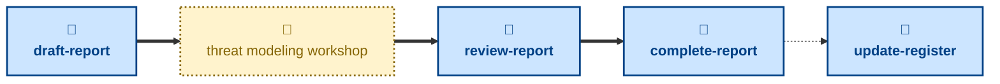

# Agent skills for managing the risk register and threat modeling workshop reports

The skills available to agents in this project are:

- **[draft-report](./draft-report/):** \
  Cuts a `report/<slug>` branch from `main`, prepares a fresh report from the
  template, and opens a pull request in a draft state.

- **[review-report](./review-report/):** \
  Checks the report has enough substance for review, and takes the pull
  request out of draft.

- **[complete-report](./complete-report/):** \
  Checks the workshop report and merges it into the `main` trunk.

- **[update-register](./update-register/):** \
  Updates the living risk register in place — mitigations shipped, reviews
  due, or risks retired — without a workshop.

The **draft-report** skill prepares a new, blank workshop report as a
draft PR. After this step, the user runs the threat modeling workshop and
writes up its findings. Once there's enough to review, **review-report**
takes the pull request out of draft. When the report is done, the
**complete-report** skill can be used to get an agent to check it over and
land the report in the `main` trunk. Independently of any workshop,
**update-register** keeps the living risk register current — marking
mitigations shipped, refreshing reviews, or retiring risks that no longer
apply.

These skills handle process, not substance: how a workshop report is
drafted, reviewed, and landed in `main`. For the threat modeling itself —
running the workshop and identifying the threats — use the
[**probe**](https://github.com/kieranpotts/skills/tree/latest/dev/skills/probe)
skill in my global skills collection.

## Compatibility

These skills are compatible with the [Agent Skills](https://agentskills.io/)
convention. Most agent harnesses support this convention natively, but
workarounds may be required for harnesses that do not.
