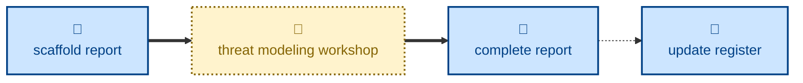

# Agent skills for managing the risk register and threat modeling workshop reports

The skills available to agents in this project are:

- **[scaffold-report](./scaffold-report/):** \
  Scaffolds a report for a threat modeling workshop, ready for the user to write up.

- **[complete-report](./complete-report/):** \
  Lands a threat modeling session's report in the `main` trunk.

- **[update-register](./update-register/):** \
  For _ad hoc_ updates to the risk register.

The **scaffold-report** skill....

## Compatibility

These skills are compatible with the [Agent Skills](https://agentskills.io/)
convention. Most agent harnesses support this convention natively, but
workarounds may be required for harnesses that do not.
