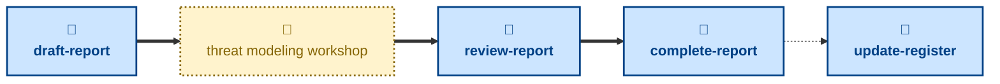

# Agent skills

The following skills are available to support the management of the risk
register and the lifecycle of threat modeling workshop reports via AI agents.

- **[draft-report](./draft-report/):** \
  Scaffolds a blank report to capture the findings from a new threat
  modeling workshop.
  Cuts a `report/<slug>` branch from `main`, prepares a fresh report from the
  template, and opens a pull request in a draft state.

- **[review-report](./review-report/):** \
  Checks the report has enough substance for review, and takes the pull
  request out of draft.

- **[complete-report](./complete-report/):** \
  Checks the workshop report and merges it into the `main` trunk.

- **[update-register](./update-register/):** \
  Updates the living risk register in place — mitigations shipped, reviews
  due, or risks retired — without a workshop.

## Workflow

The skills in this project are focused on the mechanics of managing the lifecycle of
threat modeling workshop reports and the risk register.
For help with the threat modeling process itself — running a workshop and
identifying new and changed threats — you may instruct agents to use the
[**probe**](https://github.com/kieranpotts/skills/tree/latest/dev/skills/probe)
skill in my global skills collection.

## Compatibility

These skills are compatible with the [Agent Skills](https://agentskills.io/)
convention. Most agent harnesses support this convention natively, but
workarounds may be required for harnesses that do not.
